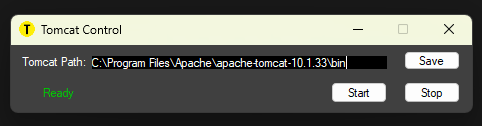

# Tomcat Control App
Tomcat Control App is a Windows Forms application designed to manage Apache Tomcat servers effortlessly. It allows users to start and stop the Tomcat server after set the installation path.

<p align="middle">
  
 </p>

## Features
-	Path Configuration: Save and validate the Tomcat installation path.
-	Start Tomcat: Initiate the Tomcat server with a single click.
-	Stop Tomcat: Safely stop the Tomcat server.
-	User-Friendly Interface: Intuitive design with clear visual indicators.
## Getting Started
### Prerequisites
-	Windows OS
-	.NET Framework 4.5 or later
-	Apache Tomcat installed on your system
## Installation
1.	**Clone the repository:**
   - ```bash
      git clone https://github.com/SASHTEK/Tomcat-Control-App.git
  	
2.	**Open the solution in Visual Studio:**
  - Navigate to the cloned directory and open TomcatControlApp.sln.
3.	**Restore NuGet packages and Certificates:**
 - In Visual Studio, restore the required NuGet packages by right-clicking on the solution and selecting Restore NuGet Packages
 - Create a new test certificate if required (Properties > Signing > Create Test Certificate)
4.	**Build the project:**
 - In Visual Studio, build the solution by clicking on Build > Build Solution or pressing Ctrl+Shift+B.
5.	**Run the application:**
 - Start the application by pressing F5 or by clicking on Debug > Start Debugging.
## Usage
1.	**Set Tomcat Path:**
 -	Enter the path to your Tomcat installation directory and click Save Path.
2.	**Start Tomcat:**
 -	Click the Start Tomcat button. 
3.	**Stop Tomcat:**
 -	Click the Stop Tomcat button. 
4.	**Status Indicators:**
 -	The application will show a green indicator when Tomcat is running and a red indicator when stopped.
## Contributing
Contributions are welcome! If you have any suggestions or improvements, feel free to fork the repository and submit a pull request.
## License
This project is licensed under the MIT License - see the LICENSE file for details.
## Acknowledgements
-	Inspired by the need to simplify Tomcat server management.
-	Thanks to the open-source community for continuous support and resources.

